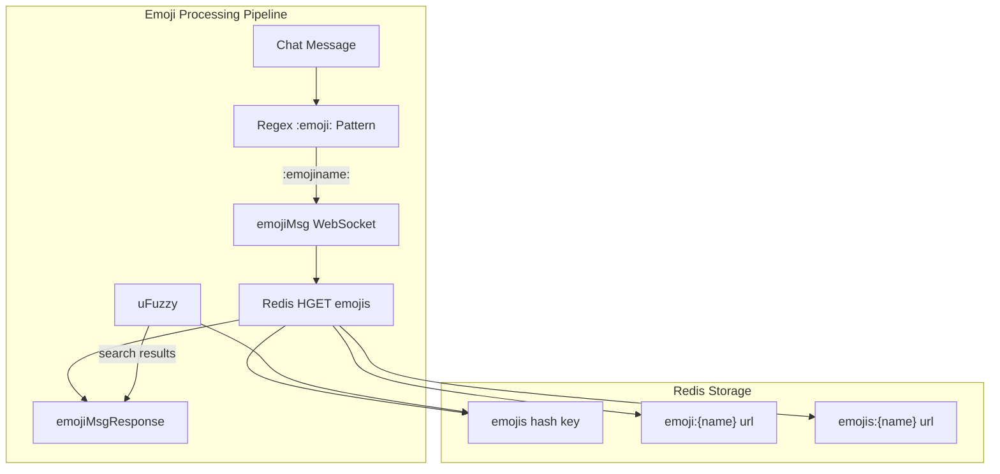

import { Aside } from '@astrojs/starlight/components';

The chat system is powered by a websocket server. Please read the entire page before implementing anything, as there are some important notes.

## Connection and messages

The websocket server is located at `wss://hackclub.tv/api/chat/ws/:username`, where `:username` is the channel you want to connect to.

You'll need to provide authentication, which can be done by providing an `auth_session` cookie, just like the REST API.

<Aside type="tip">
Bot accounts are now supported. You can choose to connect as a bot by providing a bot account's API key in one of two ways:
- Using the `Authorization` header: `Bearer hctvb_xxxxxxx`
- Using the `?botAuth=hctvb_xxxxxxx` query parameter

**Security Note:** When using the `?botAuth=` query parameter, be aware that query parameters may be logged in server logs, and/or proxy logs. Use the `Authorization` header method whenever possible. The query parameter method should only be used when connecting from an environment where headers cannot be set.

It is highly advised to use a bot account for any automated task, and to implement anything pointed out in this page.

</Aside>

Once connected, you must implement a subroutine in your code to send ping messages every about 5 seconds. This is because of Cloudflare limitations.

Messages are sent and received in JSON format. The following message types are supported:

- `session`: sent by the server immediately upon connection.
  - received by client:

    ```json
    {
      "type": "session",
      "viewer": {
        "id": "user_id",
        "username": "your_username"
      },
      "permissions": {
        "canModerate": false
      },
      "moderation": {
        "hasBlockedTerms": false,
        "slowModeSeconds": 0,
        "maxMessageLength": 400
      }
    }
    ```

    `viewer` is `null` for unauthenticated (grant-only) connections. `canModerate` is `true` for channel owners, managers, moderators, and platform admins.

- `chatAccess`: sent by the server on connect (for authenticated non-bot users) and whenever a user's restriction state changes.
  - received by client:

    ```json
    {
      "type": "chatAccess",
      "canSend": true,
      "restriction": null
    }
    ```

    When the user is restricted, `canSend` is `false` and `restriction` contains:

    ```json
    {
      "type": "timeout",
      "reason": "Timed out by moderator",
      "expiresAt": "2026-01-01T00:00:00.000Z"
    }
    ```

    `type` is either `"timeout"` or `"ban"`. `expiresAt` is an ISO 8601 string for timeouts, or `null` for permanent bans.

- `ping`: a ping message to keep the connection alive.
  - sent by client:

    ```json
    {
      "type": "ping"
    }
    ```

  - received by client:

    ```json
    {
      "type": "pong"
    }
    ```

- `message`: a chat message.
  - sent by client:

    ```json
    {
      "type": "message",
      "message": "Hello, world!"
    }
    ```

  - received by client (broadcast to all viewers of the channel):

    ```json
    {
      "type": "message",
      "msgId": "uuid-v4",
      "user": {
        "id": "user_id",
        "username": "user_who_sent_message",
        "pfpUrl": "https://example.com/avatar.png",
        "displayName": "Display Name",
        "isBot": false,
        "isPlatformAdmin": false,
        "channelRole": null
      },
      "message": "Hello, world!"
    }
    ```

    `channelRole` is one of `"owner"`, `"manager"`, `"chatModerator"`, `"botModerator"`, or `null`. `displayName` may be `undefined` for regular users.

- `history`: the recent chat history, sent upon connection.
  - received by client:

    ```json
    {
      "type": "history",
      "messages": [
        {
          "type": "message",
          "msgId": "uuid-v4",
          "user": {
            "id": "user_id",
            "username": "user_who_sent_message",
            "pfpUrl": "https://example.com/avatar.png",
            "displayName": "Display Name",
            "isBot": false,
            "isPlatformAdmin": false,
            "channelRole": null
          },
          "message": "Hello, world!"
        }
      ]
    }
    ```

    Up to 100 messages are returned. Each message has the same shape as a received `message` event.

- `systemMsg`: a system notification broadcast to all viewers, e.g. when a user is banned or unbanned.
  - received by client:

    ```json
    {
      "type": "systemMsg",
      "message": "username was banned."
    }
    ```

- `moderationError`: sent to the acting client when a message or moderation action is rejected.
  - received by client:

    ```json
    {
      "type": "moderationError",
      "code": "RATE_LIMIT",
      "message": "You are sending messages too fast.",
      "restriction": null
    }
    ```

    `restriction` is only present (non-null) for `TIMED_OUT` and `BANNED` codes, and has the same shape as the `restriction` field in `chatAccess`. Possible codes:

  | Code               | Trigger                                        |
  | ------------------ | ---------------------------------------------- |
  | `FORBIDDEN`        | Not permitted to perform the action            |
  | `RATE_LIMIT`       | Too many messages in the rate limit window     |
  | `SLOW_MODE`        | Sent before the slow mode cooldown expired     |
  | `TIMED_OUT`        | User is currently timed out                    |
  | `BANNED`           | User is permanently banned                     |
  | `MESSAGE_TOO_LONG` | Message exceeds `maxMessageLength`             |
  | `BLOCKED_TERM`     | Message contains a blocked term                |
  | `INVALID_TARGET`   | Moderation target is invalid or does not exist |
  | `INVALID_REQUEST`  | Malformed moderation command                   |
  | `NOT_FOUND`        | Target message not found (delete)              |

## Moderation commands

moderation commands are only available to authenticated users with the `canModerate` permission (`owner`, `manager`, `chatModerator`, `botModerator`, or platform admin). sending any of these without permission returns a `moderationError` with code `FORBIDDEN`.

obviously, role hierarchy is enforced: a `chatModerator` cannot moderate a `manager` or `owner`. Platform admins bypass hierarchy checks entirely.

- `mod:deleteMessage`: delete a message from the chat history and broadcast its removal.
  - sent by client:

    ```json
    {
      "type": "mod:deleteMessage",
      "msgId": "uuid-of-message-to-delete"
    }
    ```

  - received by all clients on success:

    ```json
    {
      "type": "messageDeleted",
      "msgId": "uuid-of-message-to-delete"
    }
    ```

- `mod:timeoutUser`: temporarily restrict a user from sending messages.
  - sent by client:

    ```json
    {
      "type": "mod:timeoutUser",
      "targetUserId": "user_id",
      "durationSeconds": 300,
      "reason": "Optional reason"
    }
    ```

    `durationSeconds` is clamped between 10 and 86400 (24 hours). Defaults to 300 if omitted. On success, a `systemMsg` is broadcast and the target receives a `chatAccess` update.

- `mod:banUser`: permanently ban a user from sending messages.
  - sent by client:

    ```json
    {
      "type": "mod:banUser",
      "targetUserId": "user_id",
      "reason": "Optional reason"
    }
    ```

    On success, a `systemMsg` is broadcast and the target receives a `chatAccess` update.

- `mod:liftTimeout` / `mod:unbanUser`: remove an active timeout or ban.
  - sent by client:

    ```json
    {
      "type": "mod:liftTimeout",
      "targetUserId": "user_id"
    }
    ```

    Both types behave identically and remove any active restriction for the target user. On success, a `systemMsg` is broadcast and the target receives a `chatAccess` update with `canSend: true`.

## Emoji handling

_diagram source: devin deepwiki_



When a chat message is sent, the server looks for patterns in the format `:emojiname:` using regex. For each match, it sends a request to the `emojiMsg` WebSocket.  
The server then checks Redis for the emoji URL and returns it.

When a user wants to look up an emoji (by typing `:(partial name)`), the server uses uFuzzy to find matching emojis in the Redis `emojis` hash key and returns the results.

<Aside type="caution">
  `emojiMsg` and `emojiSearch` require an authenticated connection. They are not available to
  grant-only (OBS) viewers.
</Aside>

Here's what gets sent on the websocket:

- `emojiMsg`: Looks up emojis
  - sent by client:

    ```json
    {
      "type": "emojiMsg",
      "emojis": ["aga", "yapa", "heavysob", "yay", "yay-bounce"]
    }
    ```

  - received by client:

    ```json
    {
      "type": "emojiMsgResponse",
      "emojis": {
        "aga": "https://emoji.slack-edge.com/aga.png",
        "yapa": "https://emoji.slack-edge.com/yapa.png",
        "heavysob": "https://emoji.slack-edge.com/heavysob.png",
        "yay": "https://emoji.slack-edge.com/yay.png",
        "yay-bounce": "https://emoji.slack-edge.com/yay-bounce.png"
      }
    }
    ```

- `emojiSearch`: Searches for emojis
  - sent by client:

    ```json
    {
      "type": "emojiSearch",
      "searchTerm": "aga"
    }
    ```

  - received by client:

    ```json
    {
      "type": "emojiSearchResponse",
      "results": [
        "aga",
        "aga-brick-throw",
        "aga-dance",
        "aga-transparent",
        "a-aga",
        "a-aga-transparent",
        "agaban",
        "agaboing",
        "agabounce",
        "agabusiness"
      ]
    }
    ```
